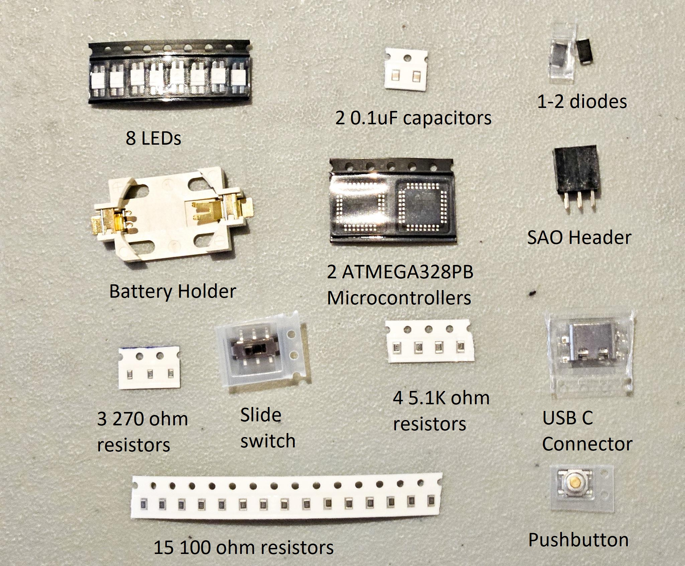
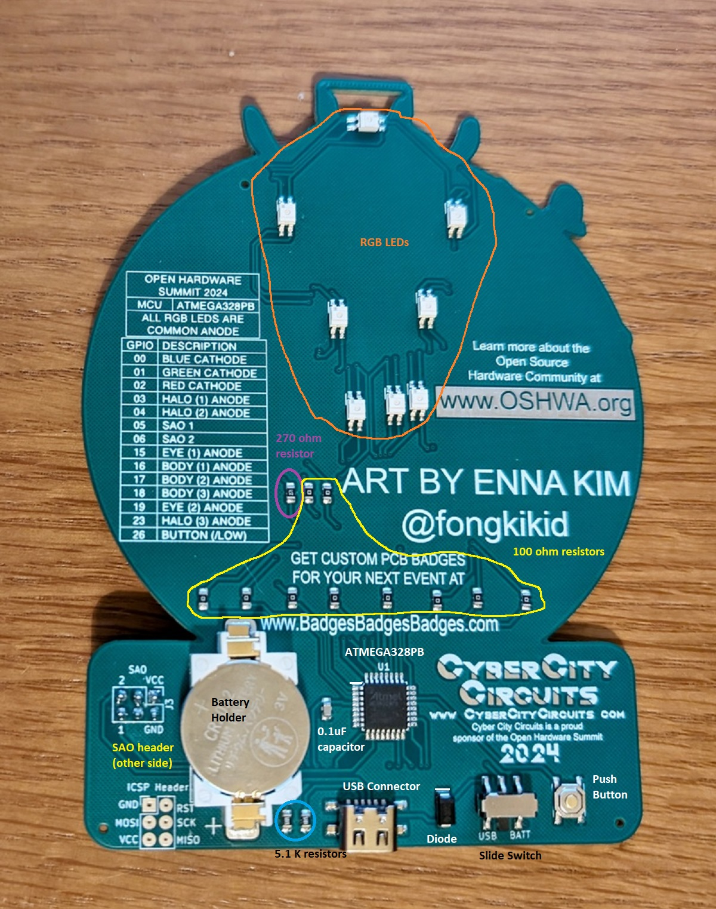
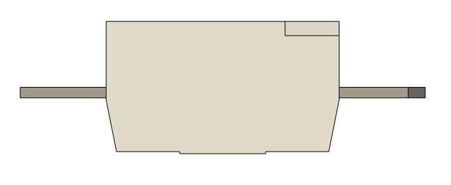
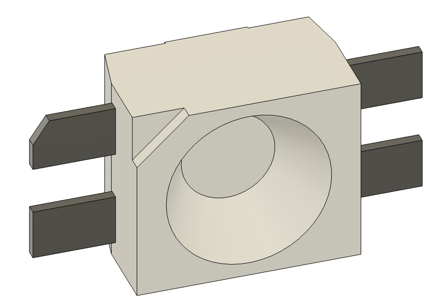
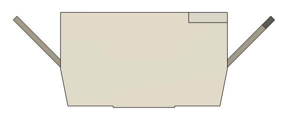
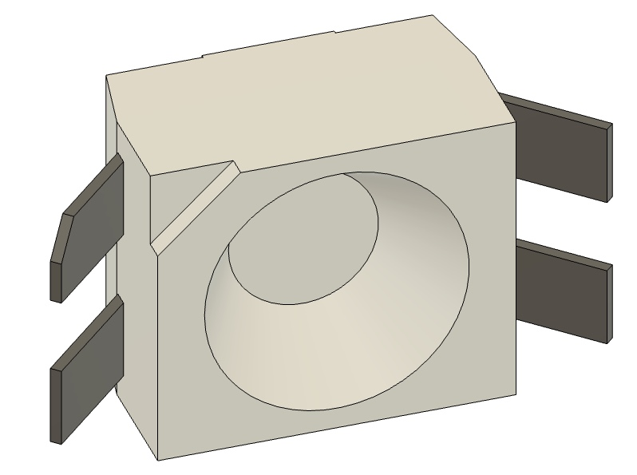
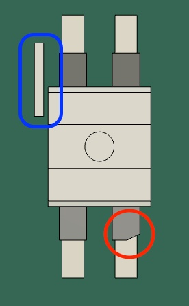

# OHS 2024 Badge Kit Assembly
Some of the badges distributed at OHS 2024 came without electronic components, unfortunately. However, we've put together some parts kits for you to try assembling it yourself!
## Parts List
You should have received the following:
- 1x Battery Holder
- 1x Pushbutton
- 1x Slide Switch
- 1x SAO header
- 1x USB Type C connector
- 1-2x Diodes (you only need one, we tried to give you a spare)
- 8x LEDs (we have a few spares, but please be careful - you need 8)
- 2x ATMEGA328PB Microcontrollers (you only need one, we gave you a spare)
- 2x 0.1uF capacitors (short paper tape, parts are brown with silver ends. You only need one, we gave you a spare)
- 3x 270 ohm resistors (blue stripe on the paper tape. You only need one, we gave you a spare)
- 15x 100 ohm resistors (long paper tape. You only need 10, we gave you spares)
- 4x 5.1K ohm resistors (short paper tape. You only need two, we gave you spares)

Here's a photo of the parts you should have:

## Where the parts go
The diagram below shows where the parts go on the board:

The biggest thing to be aware of is the mounting of the LEDs:
- We're using slightly different LEDs than were on the original boards, because they're much, much cheaper.
- The pins of the LEDs stick out straight from the body of the LED. You'll need to bend them down - this is towards the side of the LED with the clear lens. The tips of the pins should be about flush with the face of the LED.
- When you mount the LED to the board, note that one of the pins of the LED is chamfered (has a corner cut off). This pin should not be placed on the pad with the white stripe - it should be on the pin diagonally across from that.

LEDs before you bend them:

LEDs after you bend them:

LED alignment on the board:

Some other notes on placing the parts:
- The capacitors and resistors don't care which way they go on the board - there are two ways that they fit, and both work fine
- The diode is polarized. If you look at it from the right angle, you'll see a stripe on one side. This lines up with a white stripe on the board.
- The battery holder is polarized. One corner is chamfered (cut at an angle) - this is on the positive side. This lines up with the + side indicated on the PCB
- The pushbutton has 2 orientations that it will fit the pads on the board. Either of those orientations will work.
- The microcontroller has 4 ways that it will fit, but only one will work. There is an indented dot on the microcontroller - this lines up with the white stripe beside one of the pins on the PCB. Also, with the lanyard loop pointed away from you, the microcontroller should be mounted such that you can read the text.