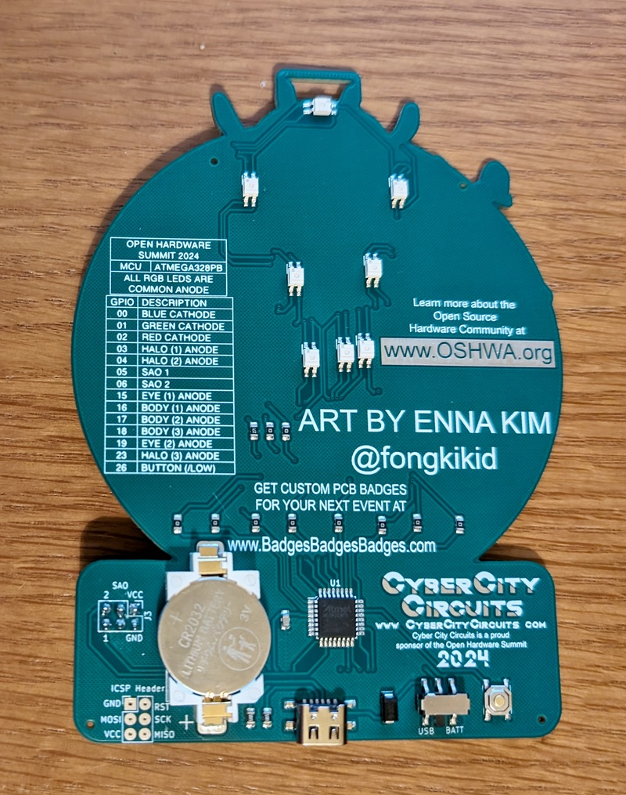
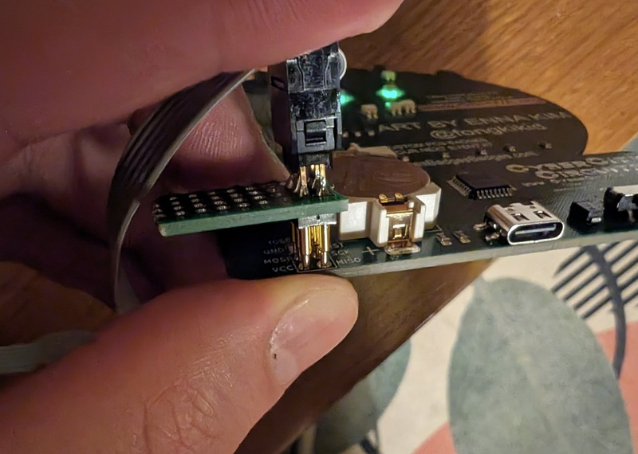

# OHS 2024 Badge

Hack your OHS 2024 Badge! There will be a hacking station during the summit to modify the badge code (we'll supply some programmers). If you want to add some of your own hardware to the badge, bring some tools and components to make your own SAO!

## Badge Overview

The front and back of the badge:

The badge features some amazing art by [Enna Kim](https://www.instagram.com/fongkikid/) and was created by [Cyber City Circuits](https://cybercitycircuits.com/).

The badge features:

- Eight RGB LEDs that light up the eyes, ring and body of the lil' guy
- Preloaded LED animations - use the push button to cycle through them all!
- Switch between battery and USB power
- [SAO connector](https://hackaday.io/project/175182-simple-add-ons-sao) with power and two GPIO pins for badge addons!

## Getting Started

### Choose Your Programmer

The badge is compatible with Arduino IDE. However, there is no USB data connection so the badge has to have an external programmer to modify the code on the microcontroller. An easy programmer to use is the [USBtinyISP](https://learn.adafruit.com/usbtinyisp/overview) which is affordable and open source. Here is a version of the board sold on Amazon:

You may need to install drivers on Windows: [https://learn.adafruit.com/usbtinyisp/download](https://learn.adafruit.com/usbtinyisp/download)

### Setup Arduino IDE

The board uses [MiniCore](https://github.com/MCUdude/MiniCore) with the [Arduino IDE](https://www.arduino.cc/en/software). Follow these instructions to install MiniCore:
[https://github.com/MCUdude/MiniCore?tab=readme-ov-file#how-to-install](https://github.com/MCUdude/MiniCore?tab=readme-ov-file#how-to-install)

Clone this repository and open [OHS2024Badge.ino](OHS2024Badge.ino) in the Arduino IDE.

Connect the USBtinyISP programmer to your computer.

From the *Tools* menu select:

- Board: -> MiniCore -> ATmega328
- Clock: -> Internal 8 MHz
- Variant: -> 328PB
- Programmer: -> USBtinyISP

**NOTE**: You do not need to set the port, the programmer will be seen as a USB device by the operating system.

Build the code by selecting from the menu *Sketch -> Verify/Compile*. If all goes well, the code should compile without any errors.

### Upload With a Programmer

Now for the tricky part: We have to hold the programmer spring-loaded (pogo) pins directly onto the exposed ICSP pads on the back of the Badge. Make sure the pins from the programmer line up with the pads on the badge. There are often labels written directly on the PCBs that tell you which pin is which. If the badge becomes powered by the programmer, you know the connection is being made properly. The following pictures show how the 2x3 pin header is arranged and how to hold spring-loaded pins directly onto the badge PCB:

While holding the pins directly onto the badge, in the Arduino IDE click the menu item *Sketch -> Upload Using Programmer* and wait for the upload process to finish. The upload progress is shown in the IDE Output.

There are easier ways to hold the pins to the badge, such as a clip or a custom jig to clamp the pogo pins. Bring your own if you have one handy!

## Modify the Code

The default code already loaded on the badge is available in the example folder: [examples/DefaultBadge/OHS2024BadgeDefault.ino](examples/DefaultBadge/OHS2024BadgeDefault.ino)

A simplified sample is provided in the main directory: [OHS2024Badge.ino](OHS2024Badge.ino).

You can modify it to make your own custom animations!

## Add an SAO

The [Simple Add-On (SAO) connector](https://hackaday.io/project/175182-simple-add-ons-sao) provides power and two GPIO pins for badge addons!
